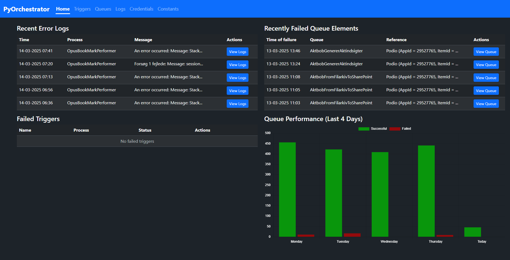
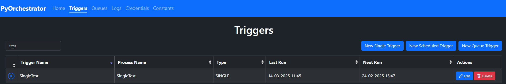
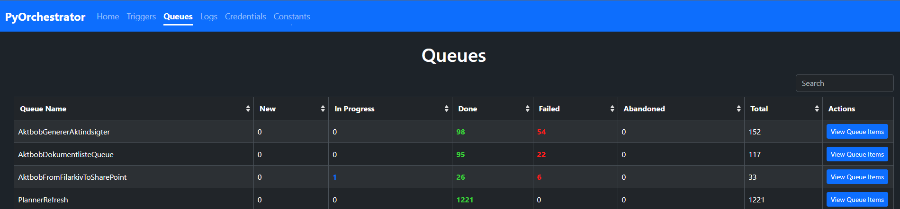
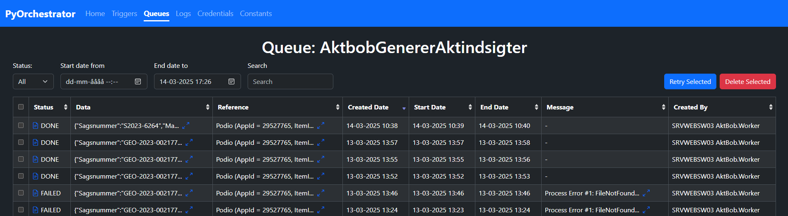
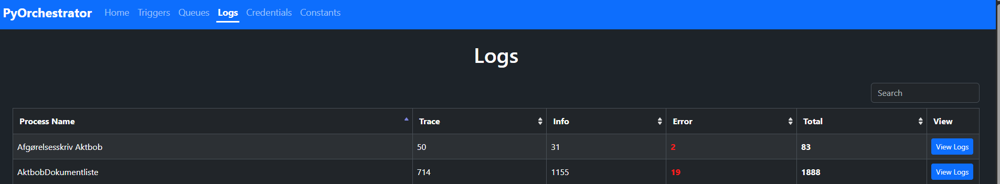
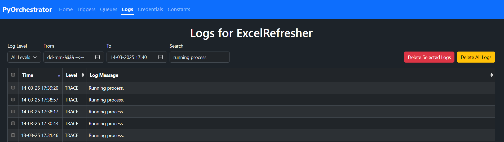
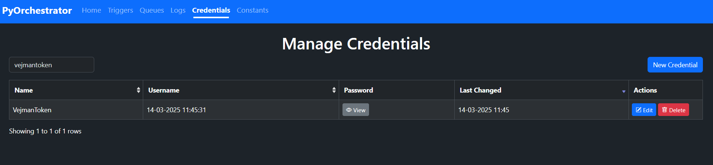
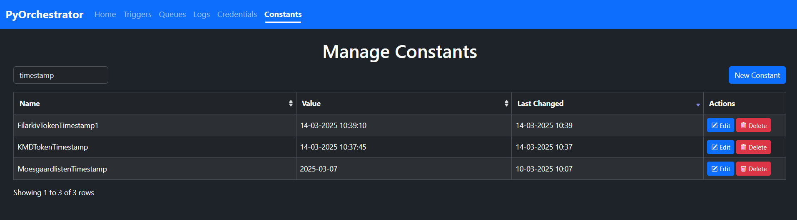

# Flask OpenOrchestrator

## Overview
PyOrchestrator is a **Flask-based** web application designed to improve database visibility and management for process logs, queues, credentials, and system constants. It builds upon the previous solution by adding **enhanced search, sorting, and filtering capabilities** for better usability and efficiency.

The application provides **a structured UI** for quickly navigating through various datasets using **Bootstrap Tables**, making it easier to locate and analyze relevant information.

## Key Features

- **Intuitive Dashboard (Home Page)**  
  - Displays an overview of recent **error logs**, **failed queue elements**, and **failed triggers** from the last few days.
  - Helps quickly identify **potential issues** without manually filtering through large datasets.

- **Enhanced Table Views**  
  - Uses **Bootstrap Tables** for **better search, sorting, and filtering**.
  - Tables dynamically load data from the backend, ensuring fast response times.
  - Predefined filters for common use cases (e.g., viewing only failed queue elements or error logs).

- **Improved Log & Queue Management**  
  - Ability to quickly locate **logs related to errors**, with a **predefined time window** around the issue.
  - Queue elements can be filtered **by status, reference, or processing time**.

- **Integrated Authentication**  
  - Uses **Windows Authentication** (NTLM) instead of requiring users to **log in manually**.
  - Access can be **restricted to a specific group or users**, without the need for storing credentials.
  - Designed to be **hosted on IIS behind a firewall** for added security.

- **Direct Credential Management**  
  - Credentials stored in the database can be **viewed directly in the browser** by providing the correct encryption key.
  - This mirrors how users could retrieve passwords via code, ensuring no additional security risk.

## Subsites & Navigation

1. **Home** (Dashboard)  
   - Quick overview of recent **errors, queue failures, and failed triggers**.
   - A **bar chart** visualizing queue performance over the past four days.

2. **Triggers**  
   - View and manage **single, scheduled, and queue-based triggers**.
   - Create new triggers via a user-friendly interface.
   - Single click start/pause for triggers with icons for an easy overview.



3. **Queues**  
   - Overview of all queues, including statuses (**NEW, IN_PROGRESS, DONE, FAILED, ABANDONED**).
   - View specific queue items and their processing history.
   - Retry and delete buttons, aswell as a button for viewing the logs for the queue element.




4. **Logs**  
   - View **detailed process logs**, with advanced filtering by **date, log level, and message content**.
   - Quickly locate **logs surrounding an error** for faster troubleshooting.




5. **Credentials**  
   - Manage and update **stored credentials**.
   - View **passwords directly** in the UI by providing an **encryption key**.



6. **Constants**  
   - Manage system-wide **constants and configurations** in the database.



## Hosting & Security

- **Designed for IIS Hosting**  
  - Can be deployed **within a Windows domain**.
  - Authentication is handled via **Windows Authentication** (NTLM).
  - Securely **runs behind a firewall**, preventing unauthorized access.

- **No Manual Login Required**  
  - Unlike the previous solution, **users do not need to log in manually** or enter **connection strings and encryption keys** every time.
  - The application determines access based on the logged-in **Windows user**.

## Summary

PyOrchestrator offers a **faster, more structured, and user-friendly** way to manage logs, queues, and credentials. With **predefined filtering**, **advanced tables**, and **secure authentication**, it provides a **seamless experience for troubleshooting and monitoring processes** in a controlled environment. 🚀

### Using `clonedb.py` to Clone MSSQL to SQLite  

To facilitate **local testing without affecting the main SQL Server**, PyOrchestrator includes a **database cloning script** (`clonedb.py`). This script allows you to **copy your entire MSSQL database into an SQLite file**, which can then be used to run the website in a **test environment**.

#### How It Works:
- Fetches **all tables and their columns** from the MSSQL database.
- Identifies **primary keys dynamically** and preserves them in SQLite.
- Converts **data types** to ensure compatibility with SQLite (e.g., **UUIDs as TEXT**, **booleans as 0/1**, **dates as TEXT**).
- Copies **all data** into the SQLite database.
- Ensures you can toggle between **SQLite and MSSQL** within the application using a **configuration setting**.

#### Why Use It?
- **Safe Testing** – No risk of modifying production data.
- **Faster Local Development** – SQLite is lightweight and easier to set up.
- **No Need for an MSSQL Server** – Test the full UI without an active MSSQL connection.

To run the script and generate the SQLite test database:
```sh
python clonedb.py
```
This will create a **`pyorchestrator_test.db`** file, which you can use when **switching to SQLite mode** in the application settings. 🚀

### **Toggling Between MSSQL and SQLite**  

PyOrchestrator allows you to switch between **MSSQL (default)** and **SQLite** for testing purposes. This is controlled in the `__init__.py` file.

---

### **How to Enable SQLite Mode**  
To run the application using the **SQLite test database**, **modify the `USE_SQLITE` variable** in `app/__init__.py`:

```python
USE_SQLITE = True  # Set to True to use SQLite, False for MSSQL
```

When `USE_SQLITE` is **True**, the application will connect to `pyorchestrator_test.db`, the SQLite database **generated by `clonedb.py`**.

---

### **How to Revert to MSSQL**  
To switch back to MSSQL, simply set:
```python
USE_SQLITE = False
```
With this setting, the application will use the **MSSQL connection string** stored in the environment variable:
```sh
OpenOrchestratorSQL
```

---

### **When to Use Each Mode?**
| Mode       | Description |
|------------|------------|
| **MSSQL (Default)** | Connects to the live SQL Server using Windows Authentication. Best for production or real-time testing. |
| **SQLite (Test Mode)** | Uses a lightweight database file (`pyorchestrator_test.db`). Ideal for local testing, debugging, or working without access to the live database. |

This toggle ensures **safe development** without modifying production data, while still providing a fully functional testing environment. 🚀

## Requirements

The project depends on the following Python packages:

```plaintext
cryptography == 44.0.2
Flask == 3.1.0
Flask-SQLAlchemy == 3.1.1
pyodbc == 5.2.0
SQLAlchemy == 2.0.38
cronsim == 2.6
waitress == 3.0.2
pymssql == 2.3.2
```

Make sure these are installed in a Python virtual environment before deploying the application.

---

## Prerequisites

1. **Install HTTP Platform Handler**  
   Download and install [HTTP Platform Handler](https://www.iis.net/downloads/microsoft/httpplatformhandler) for IIS. This is required to host Python applications.

2. **ODBC Driver**  
   Ensure an appropriate [ODBC driver](https://go.microsoft.com/fwlink/?linkid=2266337) is installed on the server to allow database connectivity.

3. **Enable IIS and Server Manager**  
   Activate IIS and related features in Windows Features or Server Manager.

4. **Python Installation**  
   Grant the following permissions to Python's installation directory and the FlaskOpenOrchestrator project folder:
   - **Users**: `IIS_IUSRS` or `IUSRS` and `AppPool\FlaskOpenOrchestrator` or `IIS AppPool\FlaskOpenOrchestrator`. You might have to change domain to the system which is hosting the website.
   - **Access Level**: Full Control

---

## Setup Instructions

### 1. Create a Virtual Environment

1. Open a terminal or PowerShell.
2. Navigate to the folder where you want the virtual environment to reside.
3. Create the virtual environment:
   ```shell
   python -m venv .venv
   ```
4. Activate the virtual environment:
   ```shell
   .venv\Scripts\activate
   ```
5. Install the dependencies:
   ```shell
   pip install -r requirements.txt
   ```

### 2. Configure IIS

1. Open **IIS Manager**.
2. Locate your site (e.g., `FlaskOpenOrchestrator`) in the left-hand tree view.

#### 2.1 Configure Environment Variables
1. Select your site and click **Configuration Editor** in the middle panel.
2. Navigate to `system.webServer/httpPlatform` and expand `environmentVariables`.
3. Add the following:
   - `OpenOrchestratorSQL`: Connection string for your SQL database.
   - `OpenOrchestratorKeyL`: Encryption keyg for your credentials.


#### 2.2 Enable Forwarding of Windows Authentication Tokens
1. Still under `system.webServer/httpPlatform`, set:
   - `forwardWindowsAuthToken`: `True`

---

## Deployment with Waitress

Waitress serves as the WSGI server for the Flask application. Make sure you add a wsgi.py file to the project folder if it isn't created already, with the following line:
```python
from app import create_app

application = create_app()
```
Create a `web.config` file in the project directory. An example `web.config` might look like this:

```xml
<configuration>
  <system.webServer>
    <handlers>
      <add name="httpPlatformHandler" path="*" verb="*" modules="httpPlatformHandler" resourceType="Unspecified" />
    </handlers>
    <httpPlatform 
    processPath="C:\PathTo\FlaskOpenOrchestrator\.venv\Scripts\python.exe" 
    arguments="-m waitress --listen=localhost:%HTTP_PLATFORM_PORT% wsgi:application" 
    startupTimeLimit="60" 
    stdoutLogEnabled="true" 
    stdoutLogFile="C:\PathTo\FlaskOpenOrchestrator\log\python-app.log" 
    processesPerApplication="1" forwardWindowsAuthToken="true">
      <environmentVariables>
        <environmentVariable name="PYTHONUNBUFFERED" value="1" />
        <environmentVariable name="PYTHONPATH" value="C:\PathTo\FlaskOpenOrchestrator" />
                <environmentVariable name="OpenOrchestratorSQL" value="connectionstring" />
                <environmentVariable name="OpenOrchestratorKey" value="encrpytionkey" />
      </environmentVariables>
    </httpPlatform>
  </system.webServer>
    <system.web>
        <identity impersonate="false" />
    </system.web>
</configuration>
```

---

## Troubleshooting Tips

1. **Permissions Issues**  
   Ensure `IIS_IUSRS` and `AppPool\NameOfWebsite` or `IIS AppPool\NameOfWebsite` have full access to both the Python installation directory and the project folder.

2. **ODBC Driver Errors**  
   Verify the correct ODBC driver is installed and accessible by the application.

3. **Environment Variables**  
   Double-check that the environment variables are properly set in IIS.

---

## License

This project is maintained by Aarhus Kommune, and published to github for inspiration and version control under the [GPL-3.0 license](LICENSE)
